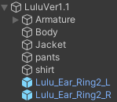

# これは何？
・ルル君用のイヤリングです  
・耳の動きに追従します  
&emsp;  
  
# 注意事項など
・対応アバターはらすちんワークス様の[ルル (Lulu)](https://aoikarasu.booth.pm/items/4271776)です  
&emsp;([ルル少年期（Lulu.juvenileVer)](https://aoikarasu.booth.pm/items/6101679)、[ルル（Ifの姿） (Lulu.AnotherVer)](https://aoikarasu.booth.pm/items/6544416)の対応状況は確認中です)  
・位置の調整は可能ですが、場所によっては追従位置が大きくズレることがあります  
・他のアバターへの導入や、指輪や腕輪として使われる場合は、  
&emsp;プレハブに付いているMA Bone Proxyコンポーネントを削除して、  
&emsp;追従させたいボーンの直下に入れてください(上級者向け)  
<!--・[ルル少年期（Lulu.juvenileVer)](https://aoikarasu.booth.pm/items/6101679)、[ルル（Ifの姿） (Lulu.AnotherVer)](https://aoikarasu.booth.pm/items/6544416)に導入する場合は、  -->
<!--&emsp;イヤリングの位置を調整する必要があります  -->
<!--&emsp;  -->
  
# 導入手順
1.&nbsp;[Modular Avatar](https://modular-avatar.nadena.dev/ja)と[lilToon](https://lilxyzw.github.io/lilToon/)をプロジェクトに追加します  
  
2.&nbsp;[Releases](https://github.com/Luke-514/Lulu_Ear_Ring/releases/latest)から**Lulu_Ear_Ring.unitypackage**をダウンロードして、プロジェクトにインポートします  
  
3.&nbsp;Assets>Luke's Assets>Lulu_Ear_Ringの中にある**Lulu_Ear_Ring～.prefab**をアバター直下に追加します  
&emsp;(Lulu_Ear_Ringはドーナツ型、Lulu_Ear_Ring2は円柱型で、左右別々に用意しています)  
&emsp;  
  
# 免責事項
本アセットの使用によって発生した、いかなる損害に対しても作者は一切の責任を負いません  
  
# 利用規約
本アセットの改変・二次配布を許可します  
(二次配布を行う際はクレジットに作者の名前を記載していただけると嬉しいです)  
  
# 作者
Luke514  
  
# Special Thanks
優希@白狼わんこ  
  
# 寄付

